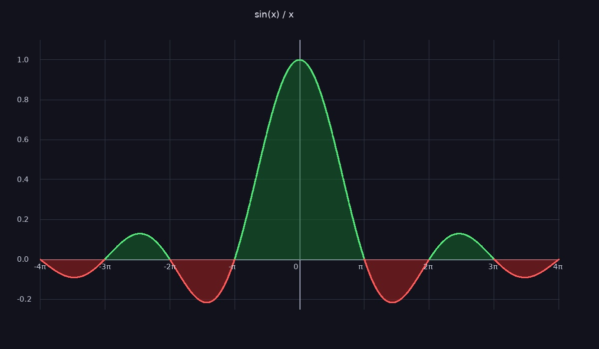

# Sinc Function Visualization

A high-resolution visualization of the function \( \mathrm{sinc}(x) = \frac{\sin(x)}{x} \), rendered as a stylized image with grid, axes, and shaded regions.

👉 **Live demo:**  
https://ramineroane.github.io/sinc-visualization/

---

## Overview

This project generates a detailed plot of the function:

\[
\frac{\sin(x)}{x}
\]

over the interval \( [-4\pi, 4\pi] \).

The visualization includes:
- a dark-themed background
- grid lines and labeled axes
- color-coded curve (positive vs negative)
- shaded regions under the curve
- high-resolution rendering to an image file

---

## Preview



---

## Mathematics

The sinc function is defined as:

\[
\mathrm{sinc}(x) = \frac{\sin(x)}{x}
\]

At \( x = 0 \), the expression is undefined, but the limit exists:

\[
\lim_{x \to 0} \frac{\sin(x)}{x} = 1
\]

The implementation explicitly sets this value to ensure continuity.

---

## Why this function matters

The sinc function appears in many areas of mathematics and engineering:

- Signal processing (ideal low-pass filters)
- Fourier analysis
- Interpolation theory (Shannon sampling theorem)

It is notable for:
- oscillations that decay as \( |x| \) increases
- a central peak at \( x = 0 \)
- alternating positive and negative lobes

---

## Implementation

- **torch** → generates a dense sampling of the domain  
- **numpy** → numerical processing  
- **Pillow (PIL)** → rendering and image creation  

Pipeline:
1. Sample \( x \) over a wide interval
2. Compute \( y = \sin(x) / x \)
3. Map values to pixel coordinates
4. Draw:
   - grid lines
   - axes and tick labels
   - shaded regions (green for positive, red for negative)
   - the curve itself
5. Save as a high-quality JPEG image

---

## Visualization details

- Domain: \( [-4\pi, 4\pi] \)
- Resolution: 1200 × 700 pixels
- Color scheme:
  - Green → positive values
  - Red → negative values
- Grid aligned with multiples of \( \pi \)

---

## Run locally

```bash
pip install torch numpy pillow
python your_script.py
